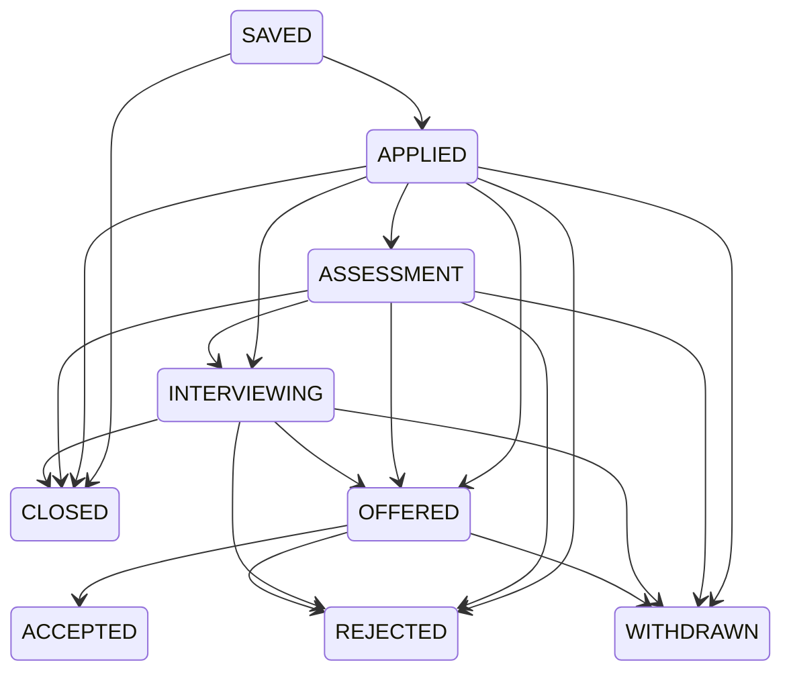

# 投递状态机

状态只能通过 `POST /api/v1/applications/{id}/transitions` 改变；请求必须携带 `expectedVersion` 和 `idempotencyKey`。

进入 `ACCEPTED`、`REJECTED`、`WITHDRAWN`、`CLOSED` 必须填写原因；终态不可继续流转。数据库乐观锁防止旧页面覆盖新版本，幂等键防止网络重试重复写入。
