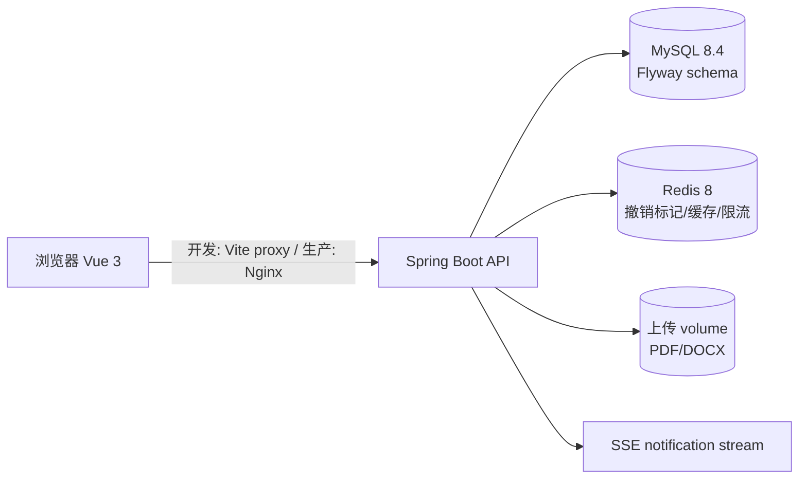

# JobTrack 架构

## 运行拓扑

生产模式只有 Nginx 暴露宿主机端口；MySQL、Redis 和 Server 只在 `jobtrack-internal` 网络中通信。开发模式保留 Docker MySQL/Redis，本地启动 Spring Boot 和 Vite。

## 后端分层

- Controller：认证、公司、岗位、简历、投递、面试、通知、Dashboard HTTP 边界。
- Service：业务规则、事务、用户归属校验和审计事件。
- Mapper：MyBatis-Plus CRUD 与 Dashboard 聚合 SQL。
- Infrastructure：JWT、Redis 安全操作、文件存储、审计、TraceId。
- Scheduler/Stream：提醒扫描和每用户最多 3 条 SSE 连接。

核心写入链为 `HTTP -> Controller -> Service(@Transactional) -> Mapper -> MySQL`；投递状态变化同时写历史，面试提醒在同一业务事务内生成。Dashboard 只读聚合，Redis 失效时回源 MySQL。
