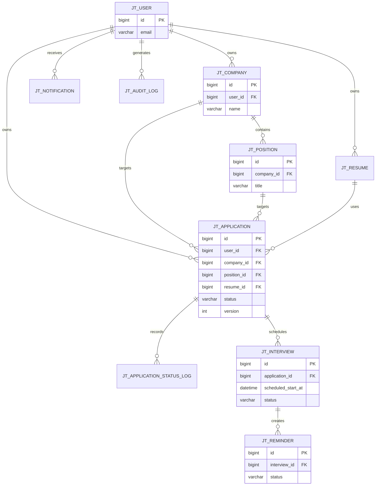

# JobTrack 数据关系概览

```mermaid
 erDiagram
    JT_USER ||--o{ JT_COMPANY : owns
    JT_COMPANY ||--o{ JT_POSITION : contains
    JT_USER ||--o{ JT_RESUME : owns
    JT_USER ||--o{ JT_APPLICATION : owns
    JT_COMPANY ||--o{ JT_APPLICATION : targets
    JT_POSITION ||--o{ JT_APPLICATION : targets
    JT_RESUME ||--o{ JT_APPLICATION : uses
    JT_APPLICATION ||--o{ JT_APPLICATION_STATUS_LOG : records
    JT_APPLICATION ||--o{ JT_INTERVIEW : schedules
    JT_INTERVIEW ||--o{ JT_REMINDER : creates
    JT_USER ||--o{ JT_NOTIFICATION : receives
    JT_USER ||--o{ JT_AUDIT_LOG : generates

    JT_USER {
      bigint id PK
      varchar email
    }

    JT_COMPANY {
      bigint id PK
      bigint user_id FK
      varchar name
    }

    JT_POSITION {
      bigint id PK
      bigint company_id FK
      varchar title
    }

    JT_APPLICATION {
      bigint id PK
      bigint user_id FK
      bigint company_id FK
      bigint position_id FK
      bigint resume_id FK
      varchar status
      int version
    }

    JT_INTERVIEW {
      bigint id PK
      bigint application_id FK
      datetime scheduled_start_at
      varchar status
    }

    JT_REMINDER {
      bigint id PK
      bigint interview_id FK
      varchar status
    }
```

## 核心关系

- 用户拥有自己的公司、简历和投递数据。
- 岗位属于公司，投递同时关联公司、岗位和可选简历。
- 投递状态变化写入状态历史，面试和提醒围绕投递生命周期展开。
- 通知和审计日志用于用户通知与系统追踪。

所有业务查询均以 `user_id` 数据隔离为基础。
